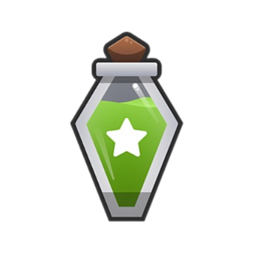
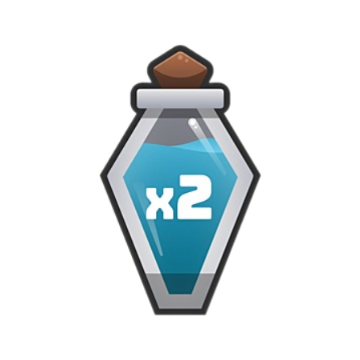
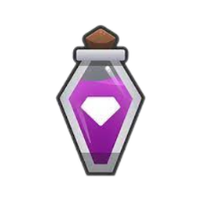

# Conqueror's Journey

## Giới thiệu chung

- **Họ tên**: Trần Mạnh Chiến
- **Mã sinh viên**: 24021395
- **Lớp**: CS7
- **Project**: Conqueror's Journeyer
- **Link giới thiệu game**: https://drive.google.com/file/d/1emjvsjPu1sByi9ODXMSFnEpz9ddaaBjj/view?usp=sharing
#### Mục lục

- [Conqueror's Journey](#conquerors-journey)
  - [Giới thiệu chung](#giới-thiệu-chung)
  
  - [1. Lời nói đầu](#1-lời-nói-đầu)
  - [2. Cấu trúc chương trình](#2-cấu-trúc-chương-trình)
  - [3. Các thành phần của game](#3-các-thành-phần-của-game)
  - [4. Hướng phát triển game](#3-hướng-phát-triển-game)
  - [5. Nguồn tham khảo](#4-nguồn-tham-khảo)

## 1. Lời nói đầu

"Conqueror's Journey" là tựa game phiêu lưu hành động, trải qua các thử thách vô cùng khắc nghiệt với tạo hình nhân vật độc đáo. Trong game người chơi phải vượt qua các chướng ngại vật thử thách từ bức tường cứng cáp đến những kẻ thổ dân hay những con đại bàng cổ thời tiền sử. Sử dụng súng mang theo bên mình để tấn công quái đông thời nhặt các vật phẩm trên đường đi để tăng sức mạnh cho bản thân và đạt được đích đến mong muốn!

## 2. Cấu trúc chương trình
Cấu trúc chương trình của "Conqueror's Journey" được tổ chức một cách hợp lý, với các thư mục và file được phân chia rõ ràng:

- **`asset/`**: Thư mục chứa tất cả các tài nguyên của game như hình ảnh, âm thanh và font chữ.
  - **`img/`**: Thư mục chứa hình ảnh cho nhân vật, chướng ngại vật, background và các vật phẩm.
  - **`sound/`**: Thư mục chứa các file âm thanh, bao gồm âm thanh nền, âm thanh bắn đạn, âm thanh va chạm, và các âm thanh hiệu ứng khác.
  - **`fonts/`**: Thư mục chứa font chữ sử dụng trong game.
  
- **`Game.cpp`** và **`Game.h`**: Định nghĩa lớp `Game`, xử lý logic chính của trò chơi như cập nhật, vẽ đồ họa, và xử lý sự kiện.
- **`Player.cpp`** và **`Player.h`**: Định nghĩa lớp `Player`, xử lý hành vi của nhân vật chính.
- **`Enemy.cpp`** và **`Enemy.h`**: Định nghĩa lớp `Enemy`, quản lý các kẻ thù trong game.
- **`Bullet.cpp`** và **`Bullet.h`**: Định nghĩa lớp `Bullet`, quản lý các viên đạn mà nhân vật chính bắn ra.
- **`Obstacle.cpp`** và **`Obstacle.h`**: Định nghĩa lớp `Obstacle`, quản lý các chướng ngại vật trên đường đi.
- **`Item.cpp`** và **`Item.h`**: Định nghĩa lớp `Item`, quản lý các vật phẩm có thể thu thập được trong game.
- **`PowerUp.cpp`** và **`PowerUp.h`**: Định nghĩa lớp `PowerUp`, xử lý các hiệu ứng đặc biệt mà nhân vật có thể nhận được khi thu thập các vật phẩm để tăng sức mạnh.
- ## 3. Các thành phần của game.
- ## a. Player:
- Người chơi tự di chuyển nhảy qua các vật cản được rand.
- Nhận các item và power up dọc đường đi để tăng sức mạnh.
- -Người chơi có một điểm đặc biệt là thanh stamine trên đầu người chơi giúp biết được chỉ số thể lực hiện tại.
- ## b. Powerup và item:
- Các vật phẩn sẽ xuất hiện dọc đường đi của nhân vật
- gồm :
- 

- Giúp tăng sức mạnh và nâng cấp nhân vật.

- ## c. Obstacle và Enemy
- Các vật cản sẽ xuất hiện ngẫu nhiên tùy theo cài đặt.
- Các kẻ địch sẽ di chuyển ngược hướng với người chơi và tấn công họ.
  
- ## 4. Hướng phát triển game.
**Ngôn ngữ lập trình**: C++
- **Thư viện**: SDL2
  - **SDL_image**: Hỗ trợ tải và xử lý hình ảnh trong game.
  - **SDL_mixer**: Hỗ trợ quản lý và phát âm thanh trong game.
  - **SDL_ttf**: Hỗ trợ sử dụng font chữ trong game.
- **IDE**: Code::Blocks
- **MinGW**: Công cụ biên dịch để xây dựng và chạy chương trình.
- - Va chạm giữa người chơi với các chướng ngại vật như đá, cây.
  - Va chạm giữa đạn và kẻ địch, đạn và chướng ngại vật.
  - Va chạm giữa người chơi và các vật phẩm thu thập được trên đường đi.
  - Va chạm giữa người chơi và kẻ địch để kiểm tra game over.
 
  - ## 5. Nguồn tham khảo
    - Sử dụng kỹ thuật chia tách file để tổ chức mã nguồn theo từng module, [Phát Triển Phần Mềm 123A-Z](https://www.youtube.com/@PhatTrienPhanMem123AZ).
    - Âm thanh(https://mixkit.co/free-sound-effects/game,https://pixabay.com/vi/music/search/nh%E1%BA%A1c%20n%E1%BB%81n%20ch%C6%A1i%20game).
    - Ảnh(chat gpt, https://vi.pngtree.com/so/nh%C3%A2n-v%E1%BA%ADt-game).
  
  - 

